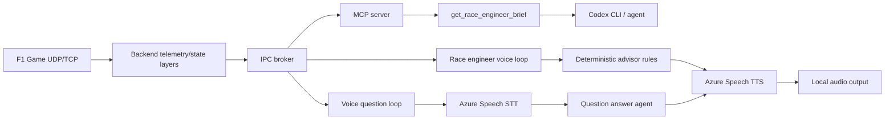

# Race Engineer Assistant Plan

## Goal

Build a race engineer assistant that turns live F1 telemetry into useful,
low-noise coaching and strategy calls. Codex CLI should be able to query the
current state through MCP, while an optional proactive loop can speak selected
messages through Microsoft Azure Text to Speech.

The assistant must not stream raw telemetry to an LLM. The app should first
compress telemetry into deterministic facts, trends, and events, then let an
agent produce the final wording when needed.

## User Experience

1. The player starts the normal launcher stack.
2. The MCP server exposes live tools for Codex CLI.
3. Codex can ask for a race engineer brief at any time.
4. The Race Engineer process can subscribe to engineer events and speak only
   the highest-priority messages.
5. The assistant should stay quiet unless something changed enough to matter.

Example calls:

- "Gap ahead 4.8 seconds. You gained three tenths last lap. Keep this pace."
- "Rear-right wear is high and rising faster than the other tyres. Avoid wheelspin."
- "Fuel is minus 0.3 laps. Lift and coast before the main braking zone."
- "Car behind is within DRS. Save battery for defence."

## Architecture

## Agent Roles

The implementation should be split into small, testable advisors. These are
not necessarily separate processes at first; they can be deterministic modules
with separate prompts and later become independent agents.

- Race Director: session status, safety car, flags, penalties, incidents.
- Pace Engineer: lap pace, sector loss, delta trends, catch/escape windows.
- Tyre Engineer: current wear, wear rates, projected stint health, temperatures.
- Fuel Engineer: live burn, target burn, surplus/deficit, lift-and-coast advice.
- ERS/Attack Engineer: battery, DRS, overtake mode, attack/defend timing.
- Damage Engineer: wing/floor/engine damage and pit urgency.
- Weather Engineer: current conditions, rain probability, drying windows, and track temperature shifts.
- Driving Coach: braking, throttle, steering, gear, speed trace comparison.
- Voice Producer: message priority, cooldowns, Azure TTS delivery, fallback.
- Review Agent: validates advice against raw evidence and prevents speculation.

## Phase 1: MCP Brief MVP

Add a read-only MCP tool:

- `get_race_engineer_brief`

Inputs:

- `focus`: optional category filter such as `all`, `pace`, `tyres`, `fuel`,
  `ers`, `damage`, `strategy`, `race_control`, or `driving_coach`.
- `max_items`: maximum number of advice items to return.

Outputs:

- session identity and progress.
- reference driver context.
- adjacent car context.
- prioritized advice items.
- evidence for each item.
- suggested natural-language callouts for voice or Codex.

This phase uses only the existing `race-table-update` state and requires no
new process, no Azure key, and no external network.

Ready when:

- Codex CLI can call one MCP tool and receive useful advice.
- Unit tests cover unavailable state, tyre warning, fuel deficit, DRS defence,
  damage warning, and pace comparison.
- The tool never emits raw milliseconds as user-facing text.

## Phase 2: Advisor Engine

Move the MVP rules into a shared `lib/race_engineer` package:

- dataclasses for facts, advice, priorities, and evidence.
- stable category names and cooldown keys.
- deterministic rule modules per advisor.
- no dependency on MCP or audio.

Ready when:

- MCP, the voice loop, and tests can use the same engine.
- Rules are deterministic and can be replayed from saved JSON snapshots.

Current implementation:

- `lib/race_engineer.brief` builds deterministic advice from one telemetry
  snapshot, including safety-car pit opportunities and traffic-aware pit-window
  strategy when pit-loss and nearby gap evidence are available. The pace rules
  can call out a specific sector loss against the player's best lap, and the
  tyre rules can warn when one tyre is wearing materially faster than the
  others, forecast when the current stint will reach 70% wear or 80% puncture
  risk, and identify the fastest live compound from recent valid laps. The
  strategy rules fold that into pit calls: near the pit window or when the
  projected stint limit arrives, the engineer can recommend a next tyre from
  the player's available tyre sets, current compound pace, and stint-record
  data when it is present in the snapshot. ERS battle calls distinguish between usable attack/defence windows
  and low-battery situations where the driver should harvest first. Fuel calls
  also compare last-lap burn against the next-lap target, so the driver can
  start saving before a small surplus becomes a deficit. Damage calls prioritise
  DRS/ERS/engine faults and serious powertrain wear from the backend race-table
  damage snapshot when the game has emitted those packet fields. Weather rules
  use the existing forecast samples to call rain arrival, drying windows, rain
  risk, and track-temperature shifts without adding new config fields. Strategy
  rules also use that forecast near the pit window to keep dry or wet tyre
  decisions flexible when rain or drying conditions are close.
- Brief responses include `agent_context`: a compact per-category workspace for
  Codex CLI with advisor order, active categories, current facts, missing
  evidence, next action, metrics, and review status. This lets category agents
  reason from the same compressed telemetry instead of raw packet streams.
- `lib/race_engineer.agent_prompts` defines role prompts and contracts for the
  advisor agents and the review agent. Category prompts can also be overridden
  from a strict JSON file through `PNG_RACE_ENGINEER_AGENT_PROMPTS_FILE`, so the
  driver can tune tyre, fuel, pace, strategy, or review-agent wording without
  changing the main app config.
- `lib/race_engineer.review` rejects unsupported or poorly formatted advice
  before MCP or voice delivery.
- `lib/race_engineer.announcer` applies priority filtering and cooldowns.
- `lib/race_engineer.history` keeps rolling completed-lap memory so proactive
  callouts can speak lap-to-lap pace trends without repeating old laps. Inside
  a five-second battle window it reports player and rival lap times, current
  gap, and gap trend once per completed lap.
- `lib/race_engineer.lap_trace` records high-frequency
  `race-engineer-trace-update` driving samples by lap distance and emits
  driving-coach advice against clean reference laps. It keeps
  `stream-overlay-update` as a fallback for older backend streams.
- `lib/race_engineer.voice` provides `dry_run` and `disabled` voice engines.
- `lib/race_engineer.azure_voice` provides an optional Azure Speech REST voice
  engine with injectable HTTP and audio backends for tests.
- `lib/race_engineer.voice_queue` keeps only the latest queued callouts so slow
  Azure playback cannot stall telemetry handling.
- `apps.race_engineer` can subscribe to `race-table-update` and
  `race-engineer-trace-update`, log dry-run callouts, or speak through Azure
  Speech.
- The MCP subscriber also records `race-engineer-trace-update` samples and
  stores the latest trace-derived `driving_coach` advice, so Codex CLI can ask
  `get_race_engineer_brief(focus="driving_coach")` without running the voice
  app. The stored advice is cleared when the trace session UID changes and is
  not returned once it becomes stale or when its session UID does not match the
  current race table. Clean completed laps overwrite old trace advice with an
  empty advice list.
- The launcher can start `apps.race_engineer` as a managed manual subsystem
  with heartbeat, shutdown, and stats IPC.
- The launcher also exposes a Race Engineer settings dialog on the subsystem
  card. It saves `race_engineer_profile.json`, a sidecar launch profile for
  startup state, voice, STT, conversation provider, prompt overrides, and UDP
  action bindings without adding a `RaceEngineer` section to `png_config.json`.
- The launcher subsystem card has live controls for mute/unmute, a radio-check
  voice test, and a typed question prompt. The typed question uses the same
  conversation provider and spoken-answer queue as push-to-talk. The launcher
  waits for the profile's configured answer timeout plus a small IPC grace
  period, so slower Codex/HTTP answers do not falsely time out at the UI layer.
- The settings dialog includes an offline `Check` action that validates the
  launch profile without revealing secrets or contacting Azure: it checks Azure
  location and key env-var presence, STT/PTT compatibility, Codex CLI command
  configuration, prompt file paths, and UDP action conflicts. It shows the same
  diagnostic next-step hints as `Preflight`, including persistent User-scope
  Azure key setup.
- The same settings dialog includes a `Voice Test` action that runs
  `--profile-voice-test` from the current form values through a temporary
  profile, so Azure TTS can be verified before saving or starting telemetry.
- It also includes a `Question Test` action that runs `--profile-question-test`
  from the current form values, verifying the selected local, HTTP, or
  `codex_cli` answer provider plus category prompt file before the game starts.
- It includes an `Audio Q Test` action that runs
  `--profile-audio-question-test` from the current form values against a chosen
  WAV file, verifying the Azure STT transcript, selected answer provider, and
  voice output as one end-to-end voice-question path.
- It also includes a `Preflight` action that runs diagnostics, one voice smoke
  test, and one profile question smoke test from the current form values, then
  reports a single ready/not-ready summary plus next steps before the game
  starts.
- The `Prompts` settings tab and standalone `--write-agent-prompts-template`
  command can generate an editable JSON template for all advisor categories, so
  custom tyre/fuel/pace/etc prompt tuning starts from the validated default
  contracts instead of hand-written field names.
- The standalone process also supports `--profile-check`, so the same offline
  launch-profile diagnostics can run from a terminal or automation before the
  game/launcher stack starts.
- `--profile-voice-test` speaks one short message using the saved launcher
  profile, so Azure TTS/profile wiring can be smoke-tested without copying
  voice options into a manual command and without starting telemetry.
- `--question-test` runs one text question through the configured local, HTTP,
  or `codex_cli` conversation provider using either a captured snapshot or a
  built-in synthetic race table. This tests the Q&A path without live telemetry,
  microphone input, or Azure TTS playback.
- `--profile-question-test` does the same but first loads
  `race_engineer_profile.json`, so launcher-side provider, command/endpoint,
  timeout, and category prompt settings are tested as a set.
- `--profile-audio-question-test` loads `race_engineer_profile.json`, reads a
  WAV/audio file, sends it through the configured speech recognizer, answers
  the transcript, speaks the answer, and prints a single JSON summary. This
  verifies the push-to-talk voice-question path before the game or wheel button
  is involved.
- `--profile-preflight` combines launch-profile diagnostics,
  `--profile-voice-test`, and `--profile-question-test` into one JSON summary
  for terminal checks, automation, or the launcher settings dialog. Its default
  question asks which tyres to fit at the next pit stop, so the smoke test
  covers the strategy/compound recommendation path. The summary includes a
  `next_steps` checklist for Azure key setup, endpoint/region setup,
  voice/question retests, live mic checks, and backend restarts after UDP
  binding changes. Azure key hints include a User-scope PowerShell env-var
  assignment with a placeholder, not the secret value, so the desktop launcher
  can read the key after restart.
- Conversation prompt packages include a radio answer contract: answer in the
  same language as the driver's question, keep it to two short spoken
  sentences, and avoid markdown/bullets. The local fallback applies the same
  short-answer formatting.

## Phase 3: Proactive Event Loop

Add a process or task that subscribes to `race-table-update`, keeps rolling
history, and emits only meaningful messages.

Responsibilities:

- track last spoken messages and cooldowns.
- detect lap changes, sector changes, DRS windows, pit windows, and urgent
  warnings.
- produce a short text callout and structured evidence.
- never block telemetry ingestion.

Recommended process placement:

- Use a new managed subsystem after the MCP brief is stable.
- Do not put audio playback inside the backend critical telemetry path.

Ready when:

- It can run with Azure disabled and log would-speak messages.
- It rate-limits repeated advice.
- It shuts down cleanly with the launcher.

Current implementation:

- `apps.race_engineer` is a standalone process.
- In managed mode, it reports PID and IPC port to the launcher, responds to
  heartbeat, returns stats, and shuts down through launcher IPC.
- Runtime stats include `assistant-status` and `assistant-status-detail`, so
  logs and the launcher card can distinguish muted, waiting for telemetry,
  listening, speaking, queued voice, and recent voice/speech/question errors.
  The launcher polls those stats while the assistant is running and turns them
  into short badges such as `Online`, `Listening`, `Speaking`, `Muted`, and
  `No Telemetry`.
- The launcher settings dialog includes profile smoke tests for voice output,
  typed questions, WAV-based audio questions, live microphone push-to-talk
  questions, and a combined preflight check. The live microphone test records
  the configured Windows microphone for a short window, then runs the same
  Azure STT -> answer provider -> TTS/dry-run voice pipeline used in a wheel
  push-to-talk session.
- The combined preflight check reports push-to-talk readiness without starting
  a surprise recording. It identifies disabled STT, blocking PTT diagnostics,
  external-audio mode, and Windows-microphone setups that should be verified
  with `Mic PTT Test`.
- It resets pending voice callouts, cooldown state, and trace references when
  the telemetry session UID changes.
- Critical callouts preempt lower-priority pending voice items so urgent
  messages are not delayed behind routine advice.
- Lap-to-lap pace advice compares the player with the cars ahead/behind and,
  once enough comparable laps exist, includes a rolling three-lap average so
  battle calls are less noisy than a single last-lap delta.
- Live race-table updates now include the player's tyre-set packet when
  available, so pit-window and Safety Car calls can say the target compound,
  not just whether to box.
- Non-critical callouts have a global minimum voice interval, configurable by
  CLI or environment, to avoid radio chatter during busy telemetry bursts.
- The default minimum spoken priority is `advisory`, so driving-coach feedback
  can be heard without a special override while still being controlled by the
  voice interval and per-advice cooldowns.
- The launcher shows a manual-start `Race Engineer` subsystem card without
  requiring new config fields or changing default startup behavior.

## Phase 4: Azure Speech TTS

Add optional Microsoft Azure Speech output.

Planned configuration:

- `RaceEngineer.enabled`
- `RaceEngineer.voice_enabled`
- `RaceEngineer.voice_provider`
- `RaceEngineer.azure_region`
- `RaceEngineer.azure_voice`
- `RaceEngineer.azure_key_env_var`
- `RaceEngineer.min_priority`
- `RaceEngineer.cooldown_seconds`
- `RaceEngineer.min_voice_interval_seconds`

Store secrets outside config by default. The config should name an environment
variable, not store the API key directly.

Current implementation uses the Azure Speech REST API through `aiohttp`, with
local playback abstracted behind an audio sink. Transient 408/429/5xx responses
and request exceptions are retried once by default before the voice result is
reported as failed. Tests use fakes and do not need network or an Azure key.
Until the config section is approved, managed launcher mode reads optional
settings from the launcher-side `race_engineer_profile.json` and environment
variables:

- `PNG_RACE_ENGINEER_VOICE_PROVIDER`
- `PNG_AZURE_SPEECH_REGION`
- `PNG_AZURE_SPEECH_ENDPOINT`
- `PNG_AZURE_SPEECH_VOICE`
- `PNG_AZURE_SPEECH_KEY_ENV_VAR`
- `PNG_AZURE_SPEECH_OUTPUT_FORMAT`
- `PNG_RACE_ENGINEER_AGENT_PROMPTS_FILE`
- `PNG_RACE_ENGINEER_SPEECH_RECOGNITION_PROVIDER`
- `PNG_AZURE_STT_LANGUAGE`
- `PNG_AZURE_STT_FORMAT`
- `PNG_AZURE_STT_CONTENT_TYPE`
- `PNG_RACE_ENGINEER_PUSH_TO_TALK_AUDIO_SOURCE`
- `PNG_RACE_ENGINEER_MIN_VOICE_INTERVAL_SECONDS`
- `PNG_RACE_ENGINEER_CONVERSATION_PROVIDER`
- `PNG_RACE_ENGINEER_CONVERSATION_ENDPOINT`
- `PNG_RACE_ENGINEER_CONVERSATION_KEY_ENV_VAR`
- `PNG_RACE_ENGINEER_CONVERSATION_TIMEOUT_SECONDS`
- `PNG_RACE_ENGINEER_CONVERSATION_COMMAND`

`PNG_AZURE_SPEECH_ENDPOINT` accepts the portal-style Azure Cognitive Services
endpoint, such as `https://francecentral.api.cognitive.microsoft.com/`, and the
voice/STT layers normalise it to the correct regional Speech REST endpoints.
The standalone app also supports `--voice-test`, which speaks one message and
exits before loading telemetry config. This gives a quick Azure key/region/voice
smoke test without starting the game, backend, or broker. Voice results include
duration, audio byte count, and synthesis attempt metadata, and the managed app
stats expose the latest voice result plus a voice failure counter for launcher
diagnostics.
When checking the launcher-side profile specifically, `--profile-voice-test`
loads `race_engineer_profile.json`, applies its saved Azure/provider settings,
and then runs the same one-message voice smoke test.
`--profile-preflight` uses the same profile path, adds offline diagnostics, a
question-provider smoke test, and a push-to-talk readiness section, then exits
before any live telemetry is loaded.
`--profile-audio-question-test` adds a deeper optional smoke test for the
voice-question chain: audio file to Azure STT, transcript to answer provider,
and answer to TTS/dry-run voice output.
`--profile-mic-question-test-seconds` exercises the local microphone variant of
that same voice-question chain and is intended as the pre-drive check for
`windows_microphone` push-to-talk setups.

Ready when:

- No Azure key is required for tests.
- Invalid key/region fails gracefully.
- Speech latency is measured and logged.
- Audio does not block the telemetry subscriber.

## Phase 4b: Voice Questions

Add a push-to-talk path so the player can ask short questions while driving.

First implementation:

1. a local recorder captures one completed audio clip while the driver holds a
   mapped wheel button.
2. the audio clip is sent to Azure Speech-to-Text.
3. the recognized text is sent to the race engineer question route.
4. a conversation provider answers from the latest compressed race engineer
   brief.
5. the answer is spoken through the same Azure TTS queue.

The first supported speech recognizer is Azure Speech short-audio REST. It is a
good fit for push-to-talk because it returns one final transcript for a short
recording. The app accepts binary `race-engineer-audio-question` messages and
text `race-engineer-question` messages, so the microphone recorder, launcher
button, wheel binding, or Codex/App Server integration can all reuse the same
answer path.

Current implementation:

- `lib.race_engineer.speech_recognition` provides Azure Speech-to-Text with
  injectable clients, the same secret env-var pattern as TTS, and a stdlib HTTP
  fallback when `aiohttp` is unavailable.
- `lib.race_engineer.conversation` provides a local conversation agent that
  infers the advisor focus from English or Russian question keywords, builds a
  live brief, and answers from the highest-priority current advice or facts.
- `lib.race_engineer.conversation` also provides an external HTTP conversation
  agent for Codex-compatible local proxies and a local `codex_cli` command
  agent. Both send only the compact `CodexConversationPromptPackage` and fall
  back to the local brief answerer if the external answerer fails, times out, or
  returns an invalid answer.
- `apps.race_engineer` subscribes to `race-engineer-question` and
  `race-engineer-audio-question`. It records question, speech-recognition, and
  answer stats, and queues the spoken answer through the normal voice queue.
- Launcher management IPC also exposes `ask-text`, so Q&A can be tested without
  a microphone or wheel button while still using the same compressed telemetry
  brief and answer provider.
- `lib.race_engineer.push_to_talk` buffers audio between push-to-talk start and
  stop events. It can accept raw PCM16 chunks and package them as WAV audio for
  Azure STT, which is the expected shape for a wheel-button recorder.
- `lib.race_engineer.microphone` provides an optional Windows WinMM
  microphone recorder. It captures local PCM chunks while push-to-talk is held
  and feeds the same `PushToTalkAudioBuffer` used by external audio clients.
- `apps.race_engineer` also subscribes to `race-engineer-ptt-control` and
  `race-engineer-ptt-audio`: `start` begins a recording buffer, binary audio
  chunks are appended while the button is held, `stop` transcribes and answers,
  and `cancel` drops the buffer without speaking.
- `PNG_RACE_ENGINEER_PUSH_TO_TALK_AUDIO_SOURCE=windows_microphone` enables the
  local default Windows microphone. The default `external` mode keeps the app
  ready for a separate wheel/launcher/audio feeder without opening a microphone.
- The launcher profile can bind one UDP action code to toggle the engineer and
  one hold action code to push-to-talk. The backend reads these sidecar bindings
  at startup and ignores a profile binding if it conflicts with an existing HUD
  UDP action code.
- Profile diagnostics report a blocking error when a push-to-talk UDP action is
  bound while speech recognition is disabled, so a wheel button cannot silently
  do nothing in the car.
- When the engineer is muted, automatic telemetry callouts are suppressed and
  question attempts receive a short muted status instead of stale advice. Audio
  questions and push-to-talk starts are rejected before microphone recording or
  Azure STT is used.

Codex-backed conversation:

- Use a Codex app-server, SDK proxy, local HTTP bridge, or local wrapper around
  Codex CLI as a replaceable text answer provider.
- Send only the compact `get_race_engineer_brief`/`agent_context`,
  `agent_prompt_specs`, reviewed advice, and the driver's text question, not raw
  telemetry streams.
- Keep Azure STT/TTS as the audio layer; swap only the text answer provider.
- Configure through environment variables until the settings UI/config section
  is approved: `PNG_RACE_ENGINEER_CONVERSATION_PROVIDER`,
  `PNG_RACE_ENGINEER_CONVERSATION_ENDPOINT`,
  `PNG_RACE_ENGINEER_CONVERSATION_KEY_ENV_VAR`, and
  `PNG_RACE_ENGINEER_CONVERSATION_TIMEOUT_SECONDS`. For a local CLI wrapper,
  set `PNG_RACE_ENGINEER_CONVERSATION_PROVIDER=codex_cli` and
  `PNG_RACE_ENGINEER_CONVERSATION_COMMAND` to a command that reads the prompt
  package JSON from stdin and writes either `{"answer": "..."}` JSON or plain
  answer text to stdout.

Ready when:

- The settings UI can enable/disable Q&A and choose STT language.
- UDP action mappings can toggle the engineer and start push-to-talk.
- The recorder can capture PCM16 or WAV audio and publish it without blocking
  telemetry.
- Codex-backed answers are optional and degrade to the local brief answerer.

## Phase 5: Lap Trace Recorder

For driving coaching, collect high-frequency samples per lap:

- lap distance.
- current lap time.
- speed.
- throttle.
- brake.
- steer.
- gear.
- ERS/DRS state.
- wheel slip.
- yaw/angular velocity where available.

Store traces in distance bins, for example every 5 or 10 metres. Keep only
clean laps for references.

Ready when:

- The app can compare current lap vs personal best by distance.
- It can identify early/late braking, long coasting, weak throttle pickup,
  wheelspin, understeer/oversteer signs, and speed loss by segment.

Current implementation:

- The backend publishes `race-engineer-trace-update`, a compact high-frequency
  payload built directly from the reference driver's `CarTelemetryData` and
  latest `LapData`, including current-lap validity and pit status.
- When existing track-segment metadata is available, the backend trace also
  includes segment labels for human calls, such as named corners, turn ranges,
  or named straights.
- Negative pre-start lap distances and pit-lane samples are ignored so they do
  not become misleading reference-lap data.
- The standalone race engineer records those samples by default, while retaining
  `stream-overlay-update` as a fallback if the dedicated trace topic has not
  appeared yet.
- The driving coach currently detects brake/throttle overlap, early braking,
  long coasting, weak throttle pickup, and general speed loss against the best
  clean reference lap.
- Completed laps must meet a minimum distance-bin coverage ratio before they
  are used as reference laps or compared for advice. Driving-coach advice
  includes current/reference coverage evidence so the review agent can reject
  weak comparisons.
- A later refinement can move sampling even closer to
  `SessionState.processCarTelemetryUpdate()` if multi-driver/reference traces
  need per-packet timing instead of the current high-frequency IPC tick.

## Phase 6: Corner and Track Intelligence

Use existing track segment metadata to name advice by sector or segment. Later,
generate per-track corner maps from packet captures.

Ready when:

- Advice can say "sector 3" immediately.
- Later versions can say "turn 14" or a named segment where metadata exists.

Current implementation:

- `race-engineer-trace-update` includes optional `segment-label` and
  `segment-voice-label` fields when `assets/track-segments` contains the active
  circuit.
- Driving-coach advice prefers the segment label in spoken and written calls,
  while keeping sector and distance evidence for review.

## Testing Strategy

- Unit tests for deterministic advisor rules using hand-built snapshots.
- Replay tests from saved captures or session JSON.
- MCP schema tests for every new tool.
- Voice dry-run tests with fake TTS provider.
- Fault tests for disconnected telemetry, missing driver, missing telemetry
  permissions, stale data, Azure failure, and repeated messages.

## Implementation Order

1. Add `get_race_engineer_brief` to MCP.
2. Extract advisor logic into `lib/race_engineer`.
3. Add rolling history for lap-to-lap trends.
4. Add proactive loop in dry-run mode.
5. Add Azure TTS provider abstraction.
6. Add launcher-managed manual subsystem mode.
7. Add lap trace recorder.
8. Add driving coach rules.
9. Add review and safety checks for all generated agent wording.
10. Add voice question STT and local brief answer path.
11. Add approved `RaceEngineer` config section and settings UI.
12. Add UDP action toggle and push-to-talk recorder.
13. Add optional Codex app-server conversation provider.
